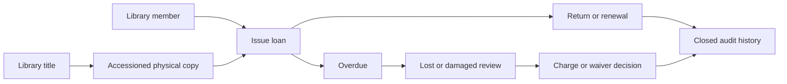

# Library Circulation and Accession Register Plan

## Status, purpose, and audit decision

Prompt 16E is planning only. No library schema, route, API, scanner, RFID, financial posting, backup array, or UI was added. The implementation baseline has a books-finance subsystem (`BookCatalogItem`, rates, `BookSaleReceipt`, `BookCashSettlement`) and shared `Vendor`/`ExpenseRecord`/`ExpensePayment` records for publisher bills. Those records are stable sales, settlement, and expense evidence; they are not a circulation catalogue or an accession register.

The future library module must therefore use a clean catalogue-title and physical-copy design. It may retain optional, non-authoritative cross-references to a vendor or an existing expense/invoice for provenance, but it must never reinterpret, create, cancel, or value books-finance records. `BookCatalogItem` is not reused as the circulation title because it has an item code, sales policy, academic-year rates, receipt lines, and optional required buyer link rather than bibliographic and copy-level identity. A later optional mapping can link a title to a sale item only after an operator reviews it; no automatic sync is safe.

Existing safe patterns to reuse are server-side `requirePermission`/`requireApiPermission`, DB-backed `RolePermission`, `Prisma.Decimal` validation, India-local `localDate`, immutable/cancelled financial history, append-only audit rows, allowlisted restricted serializers, formula-safe `csvCell`, preview-first imports, and backup validation/idempotence. Do not reuse books-sale receipt numbers, cash settlements, financial permissions, or student fee `Payment` data.

## Concepts and boundaries

| Record | Purpose | Must remain separate from |
|---|---|---|
| Books-finance catalog | Items sold to students, sales rates, publishers, receipts, and cash settlement. | Borrowable library titles and physical copies. |
| Library bibliographic title | Intellectual work: title, authors, ISBN, edition, publisher, subject, language, classification, shelf guidance, and loan policy. | A priced sale item or a single physical copy. |
| Library physical copy | One accessioned copy of one title with a permanent accession number, optional barcode/RFID tag, condition, source, availability, and circulation history. | Sales quantity, book-sale receipt line, and inventory valuation. |
| Library charge | A future operational claim for overdue/lost/damaged handling. | Student fee dues, `Payment`, book-sale receipt, and expense payment. |

Publisher and vendor information may be duplicated as a title's publisher text and optionally linked to the existing `Vendor` master for acquisition provenance. The publisher text is bibliographic; a `Vendor` is a purchasing counterparty. Do not assume they are the same party.

## Members and borrowing policy

Create one active library membership per `Student` or `StaffMember`, never both. Membership status is `ACTIVE`, `INACTIVE`, or `SUSPENDED`; suspension needs a reason and optional end date. A membership cannot be duplicated for the same linked person, even after code corrections. An optional external/special member type is a later policy decision, not part of the first implementation.

Policy determines student/staff loan periods, maximum open loans, renewal limit, allowed copy categories, reservation hold period, suspension conditions, and outstanding-book restrictions. Class and staff-role overrides must have deterministic precedence and a visible effective-policy explanation. Staff membership should link through the existing `StaffMember.userId` relationship when an authenticated account exists, so teacher self-service is based on the linked account rather than a client-provided member ID.

## Circulation lifecycle

Copy status is current physical availability; loan status is its own immutable operational timeline.

Allowed circulation states are `AVAILABLE`, `RESERVED`, `ISSUED`, `OVERDUE`, `LOST`, `DAMAGED`, `UNDER_REPAIR`, `WITHDRAWN`, `MISSING`, and `REPLACED`. `REPLACED` preserves the original copy history and points to its successor; it is not an accession-number reuse. To prevent contradictory stored states, an open loan is the canonical source for `OVERDUE`: when its due date is before the India-local business date, the loan is `OVERDUE` and the copy's effective displayed state is `OVERDUE`; otherwise the on-loan copy is `ISSUED`. A later implementation must not independently edit copy and loan overdue flags. `RESERVED` means a specific available copy has been allocated to an eligible reservation during its hold period; an unallocated title reservation does not make every copy reserved.

The server-side workflow is issue, return, renew, reserve, cancel reservation, mark overdue, report lost, report damaged, accept replacement, propose/approve waiver, settle charge later, and correct only through a compensating audit event. Before issue, transactionally verify that the copy is available, the member is active, the effective policy permits the loan, the member has capacity, and no blocking outstanding item exists. A unique/transactional open-loan guard must make a double issue impossible. Renewals fail when the renewal limit is reached, the copy is reserved for another eligible member, or the borrower is no longer eligible. Returned and final lost/damaged loans are never silently edited; corrections preserve the original event and state why a compensating event was needed.

Lost/damaged actions require a reason, condition assessment, actor, date, and approval when policy requires it. Every circulation action records actor, timestamp, prior/current values, and a safe user-facing reason. Barcode/RFID identifiers are copy lookup values only, never credentials.

## Due dates, calendar dependency, and notifications

Default loan periods must be explicit for students and staff, with class/role/category overrides and a bounded renewal count. Initial implementation may calculate calendar-day due dates only if the school accepts that policy. A school-working-day/holiday calendar is a stated dependency before implementing working-day due dates, holiday grace, or automated overdue notices; do not fabricate it from attendance data. Store the policy/version or effective snapshot used at issue so later rule changes do not rewrite an existing loan's due-date rationale.

## Fines, charges, waivers, and financial boundary

Future charge categories are overdue fine, lost-book charge, damaged-book charge, replacement-book acceptance/credit, waiver, partial waiver, and settlement status. A lost/damaged decision records assessment basis, policy amount, waived amount, approval, outstanding amount, and whether a replacement copy was accepted. It must prevent two active charges for the same underlying incident and must preserve a cancellation/reversal trail rather than delete a final assessment.

Recommendation: use **Option A, a dedicated `LibraryCharge` operational model**, then create a linked miscellaneous-income receipt only when an authorized payment is actually collected. The charge remains the authoritative obligation and waiver history; the future payment adapter creates one configured active Miscellaneous Income item/line only once and stores the resulting receipt reference. A unique receipt link and an atomic check that the charge is collectible prevent double collection. This keeps library workflow separate from fees, gives Miscellaneous Income its own receipt numbering and cash-book integration exactly once, supports parent-visible status without exposing payment references, and allows a controlled correction later.

Before the linked receipt is final in an operational cash-book workflow, an authorized cancellation must cancel the receipt under the existing Miscellaneous Income rules, clear/void the payment link through an append-only charge event, and reopen only the remaining approved balance. After the receipt has affected a locked cash-book day, do not silently cancel/reopen it: use a separately approved future compensating refund/correction workflow, preserve the original receipt and cash-book evidence, then record the charge correction event. A waiver changes the charge balance only; it never edits a receipt. Parent views show only their linked child's safe title/copy, amount/status, and approved receipt reference/print entitlement if later explicitly enabled; they do not receive waiver reasons, staff data, payment references, or raw audit events. Option B (directly creating a configured `MiscIncomeItem` for every assessed fine) is simpler, but makes unpaid balance, partial waiver, replacement credit, and duplicate-collection prevention depend on receipt data rather than a dedicated audit record. Do not build either option in this phase.

## Accession register policy

An accession number is the school library's permanent, immutable, school-wide copy identifier. Recommended format: `LIB-YYYY-NNNNN` with a monotonic sequence; the final school prefix and legacy-number migration rule need operator confirmation. It is allocated once, never reused after withdrawal, loss, replacement, or correction, and appears in the printed/exported accession register. A barcode may encode the accession number; a separate generated barcode is acceptable only when it remains unique and permanently mapped to the copy.

The register records title/edition, accession number, acquisition date and type, source/vendor/donor, invoice or expense reference, acquisition cost, publisher, subject/class, condition, shelf/location, current status, withdrawal/write-off date/reason, and notes. Physical copies are never hard deleted once accessioned. Correct a mistaken field through an audited event; retain the original value and reason. Imports are preview-first, and historical withdrawn/write-off rows remain searchable under restricted reporting.

## Barcode first, RFID later

Barcode is the first implementation: low cost, easy to print on labels, browser compatible, and usually supported by USB scanners acting as keyboard input. The issue/return screen needs a focused scan field, accession/barcode lookup, duplicate-scan debounce/idempotency protection, a visual copy-and-borrower confirmation, Enter-key handling, manual type/search fallback, and clear mismatch/unknown-label errors. Label printing should include human-readable accession number, barcode, title shorthand, and a reprint audit, without exposing borrower information.

RFID is future-only. Select a vendor only after receiving device/manual, reader SDK/API evidence, supported tag standard, offline behavior, export/API documentation, data ownership/retention terms, recurring charges, warranty/support, and a live acceptance test. A tag identifies a library copy only; it is never user authentication, attendance, location tracking, child tracking, or staff tracking. The design must provide an offline/manual fallback and avoid vendor lock-in through documented tag/export formats and a replaceable reader adapter. Barcode remains recommended until device evidence and a quantified operational benefit justify RFID.

## Imports and migration

Provide separate preview templates for library titles, physical/accession copies, student/staff memberships, and currently issued books from a legacy register. Validate every row before apply and show ready/error/warning totals, row number, and actionable reason. Match students only by exact admission number and staff only by exact staff code; do not silently fuzzy match names. Block duplicate accession, barcode, RFID, and active membership links. ISBN/title matching is review-assisted: an exact normalized duplicate may be proposed, but title/author/edition conflicts require an operator choice.

Exports must use allowlisted columns, CRLF CSV, safe filenames, and formula-neutralized cells. The import run needs a stored or documented verification dashboard: source counts, created/skipped/error rows, unmatched people, duplicate collisions, open-loan reconciliation, operator, timestamp, and pre-import backup reference. Recovery is pre-import backup plus a scoped, reviewed cleanup/reversal plan; never promise automatic deletion after partial apply.

## Permissions, portals, and privacy

Future permissions are `VIEW_LIBRARY`, `MANAGE_LIBRARY_CATALOG`, `MANAGE_LIBRARY_COPIES`, `MANAGE_LIBRARY_MEMBERS`, `ISSUE_LIBRARY_BOOKS`, `RETURN_LIBRARY_BOOKS`, `MANAGE_LIBRARY_RESERVATIONS`, `MANAGE_LIBRARY_CHARGES`, `WAIVE_LIBRARY_CHARGES`, `MANAGE_LIBRARY_POLICIES`, `RUN_LIBRARY_STOCK_VERIFICATION`, `VIEW_LIBRARY_REPORTS`, and `EXPORT_LIBRARY_REPORTS`. All future page and API checks must be server-side, not UI-only.

| Role | Recommended default |
|---|---|
| Super Admin / Director | All library permissions. |
| Admin | Broad operations; no `WAIVE_LIBRARY_CHARGES` unless explicitly enabled. |
| Principal | View/reports; waiver approval only if policy grants it. |
| Library In-charge | Catalog, copies, members, issue/return, reservations, reports; no role editing or sensitive waiver approval by default. |
| Accountant | Charge/payment-status read-only only when the chosen financial adapter needs it; no catalogue/circulation writes. |
| Teacher | Own membership, loans, and reservations only. |
| Parent | Linked-child loans, due/overdue summary, and charge status only in a later portal phase. |
| Viewer/Auditor | Read-only aggregate/report access with borrower identifiers masked unless a specific audit need is approved. |

A Library In-charge can initially be a permission bundle rather than a new global role. Student borrowing history is private student data; staff history is private staff data. Parent requests must first prove a linked `StudentGuardian` relationship (the existing parent portal's safe pattern) and never accept a child ID alone. Teacher self-service must derive the staff member from the authenticated user. Reports must minimize borrower fields; raw internal IDs, password hashes, secrets, filesystem paths, full payment references, and private actor identifiers are never returned to portal/restricted roles.

## Future routes, screens, and reports

Plan `/library`, `/library/catalog`, `/library/catalog/new`, `/library/catalog/[id]`, `/library/accession-register`, `/library/copies/[id]`, `/library/members`, `/library/circulation`, `/library/issue`, `/library/return`, `/library/reservations`, `/library/overdue`, `/library/charges`, `/library/stock-verification`, `/library/reports`, `/teacher/library`, and `/parent/library`. Mobile issue/return must keep the scan field focused, show one unambiguous copy lookup then borrower lookup, require a clear confirmation, suppress accidental duplicate submission, and retain a manual/offline fallback.

Reports: accession register; title-wise copy count; available/issued/overdue/lost/damaged/withdrawn; student and staff borrowing; class-wise borrowing; overdue ageing; most-borrowed and inactive titles; charge/waiver status; stock-verification discrepancies; acquisition/vendor summary; and withdrawn/write-off register. Print and CSV are permission-gated, formula-safe, locally dated, use exact Decimal text for charges/costs, and apply the portal/privacy rules above.

## Stock verification, procurement, valuation, and backup boundary

Stock verification is a later controlled session: select scope and cut-off, snapshot expected eligible copies, scan/count each copy, record missing/found/condition discrepancies and reason, require reviewer/approval for finalization, and preserve the session/audit record. It must not directly write off a copy, change an open loan, or create a charge without a separate reviewed action.

Circulation is not procurement: no requisition, quotation comparison, purchase order, goods receipt, invoice approval, or supplier payment workflow is included. It is not inventory valuation: no opening stock value, depreciation, cost accounting, replacement value, or financial stock valuation. A future copy may optionally link vendor, acquisition cost, and existing `ExpenseRecord`/invoice metadata for provenance, but it must never create a second expense/payment ledger. Future durable library entities need their own versioned backup arrays, restore order (titles before copies, members before loans/reservations/charges, sessions before verification records), reference validation, backward compatibility, idempotent collision behavior, and password-hash exclusion. This prompt adds none.

## Delivery sequence and acceptance gates

1. **Prompt 16F — Library Catalog and Accession Register Foundation:** bibliographic titles, physical copies/accession register, vetted title/copy import preview, catalogue/copy/report permissions, backup/restore, and non-circulation reports only. It must not add members, loan policy, issue/return/renewal/reservation, overdue, fines/charges/waivers, parent/teacher library views, barcode scanner/label integration, RFID, procurement, purchase orders, or inventory valuation.
2. **Prompt 16G — Library Membership, Issue, Return, Renewal, and Reservation:** transactional lifecycle, own-account isolation, audit, due-date policy, no charges/payment.
3. **Prompt 16H — Library Overdue, Lost/Damaged, Fines, Waivers, and Parent/Teacher Views:** charge design and controlled Miscellaneous Income adapter after finance acceptance.
4. **Prompt 16I — Library Barcode Labels and Scanner Workflow:** keyboard-scanner hardening, labels, browser/manual fallback.
5. **Prompt 16J — Library Stock Verification:** session, discrepancy, reviewer workflow, reports.

RFID waits for vendor/device evidence. Procurement and inventory valuation remain separately approved later phases. Every implementation phase should prove intended and blocked roles, restore isolation, import preview safety, no impact on books-finance/fees/cash book, and cleanup before the final backup.

## Prompt 16F implementation update

The catalog/accession foundation is now implemented. `LibraryTitle`, `LibraryCopy`, and append-only `LibraryCopyEvent` provide separate bibliographic and physical-copy identity. Accession numbers are immutable and never reused; withdrawn copies remain searchable. Exact-match preview/confirm imports, non-circulation reports/CSV, conservative permissions, and backup/restore version 19 are built. See `LIBRARY_CATALOG_AND_ACCESSION_WORKFLOW.md` for the operator contract.

## Prompt 16G implementation update

Memberships, explicit policies, transactional issue/return/renewal, title reservations, queue fulfilment, derived overdue, reports/CSV, permissions, and backup/restore version 20 are now implemented. Open-loan uniqueness uses the database-enforced optional `activeCopyKey`; physical copy status is not changed by circulation. Read `LIBRARY_MEMBERSHIP_AND_CIRCULATION_WORKFLOW.md` for the operator contract.

Prompt 16H remains future work for separately reviewed lost/damaged/charge/waiver and portal scope. Barcode labels/scanning, RFID, stock verification, procurement, and valuation remain unbuilt.
## Prompt 16H implementation note

The accountability phase is implemented with explicit incidents, rule-guided charge assessment, approval, full/partial waivers, exactly-once Miscellaneous Income collection, append-only audit events, operational/financial reports, and ownership-isolated Parent/Teacher views. It does not post to student fee `Payment` or dues. Prompt 16I remains barcode labels/scanning only; Prompt 16J remains stock verification only. RFID, procurement, and valuation remain separately absent.
# Prompt 16J completed foundation

The accession/circulation plan now includes controlled stock-verification sessions, immutable expected-copy snapshots, exact scanning, itemized discrepancy decisions, explicit append-only corrections, separate approval/final lock, safe reports/CSV, and backup v22. RFID, camera scanning, valuation, procurement, accounting, automatic charges, and location tracking remain outside scope. Next planned phase: Prompt 17A.
