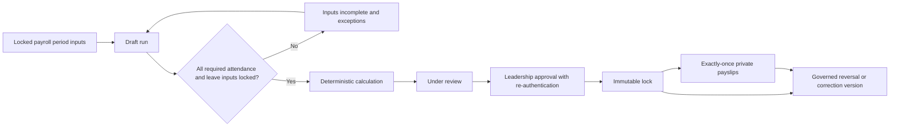

# Governed Payroll Workflow and Lifecycle

Prompt 23I calculates salary and issues private payslips. It does not disburse salary, mark salary paid, file statutory returns, automate EPFO/ESI, collect full identity/bank identifiers, or connect to an external payroll provider.

## Versioned inputs

Every structure and Staff assignment is effective-dated. A revision ends the prior assignment and creates a new assignment plus an append-only `SalaryRevision`; it never rewrites an earlier month. Calculation records exact payroll-period, policy, structure, assignment, attendance, leave, advance-schedule and component-version references.

Accountants prepare, calculate, resolve exceptions and submit only with exact permissions. Director, Super Admin or explicitly permitted leadership approve and lock with re-authentication. Principal has no implied salary authority. Locked runs, results, component results and issued payslips are protected by application compare-and-set rules and database triggers. Corrections and reversals are new versions.

No hard-delete workflow exists for approved structures, salary revisions, locked payroll, payslips or advances. Duplicate request keys, one active run per period, expected versions, unique result/component constraints and unique payslip versions guard concurrency.
