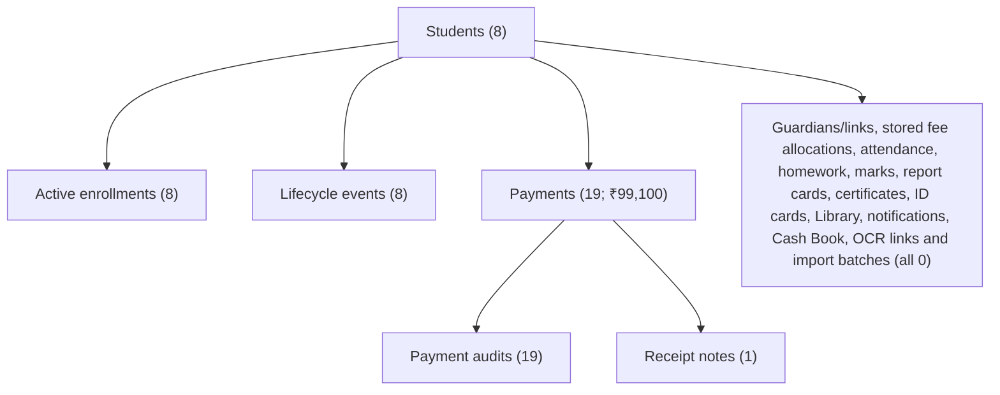

# DATA-0A Pre-Existing Sample Data Provenance and Cleanup Plan

**Audit date:** 28 July 2026
**Scope:** local operational SQLite baseline only
**Operational database action in DATA-0A and DATA-0A-QA:** read-only
**Final decision:** `VERIFIED_SAMPLE_DATA_SAFE_FOR_CONTROLLED_DELETION`
**Independent QA result:** `SAMPLE_DATA_PROVENANCE_CLEARED`

## Decision and approval gate

The eight active Students and eight active enrollments are exact seed fixtures.
Eleven Payment rows totalling ₹92,100 exactly match the source seed. The other
eight Payment rows total ₹7,000 and are independently verified QA fixtures:
four have an explicit QA marker, four use the repository's QA receipt prefix,
all eight have exact `CREATED` audit evidence, and each four-row group was
created within a sub-30-millisecond window. They are linked only to the same
seeded Students. No record is classified as sample merely because it looks
synthetic. No import, Guardian, attendance, academic, certificate, Library,
Cash Book, OCR or other potentially real dependent record was found.

This finding does **not** itself authorize deletion. Explicit user approval is
still required before the operational cleanup command in this document may be
run. The command is a developer-only CLI operation and is not present in any
ordinary operator-facing UI.

DATA-0B must first close two separate production-readiness gates: prevent
ordinary seeding from targeting the operational database, and rotate every
enabled seed-account password. Operational deletion has not occurred.

## A. Preflight evidence

| Check | Evidence | Result |
|---|---|---|
| Git baseline | `main` was clean and synchronized with `origin/main` before the audit branch was created | PASS |
| Origin | Expected private repository `vsairohith67/nalanda-school-erp`; GitHub reports private visibility | PASS |
| Latest verified baseline | `0e45853b66b6c52bb035053597b833d57058cfd9`, tagged `schoolknot-finance-policy-reconciliation-v37-2026-07-28`; previous runtime release `f1c29def5073d45e486878481e2b6e2d2b069e8d` | PASS |
| DATA-0A branch pre-QA state | `codex/data-0a-provenance-audit` existed locally at the exact `main` base; it had no branch commit, no remote branch and contained the uncommitted DATA-0A files on the correct branch | PRESERVED FOR GIT CLOSURE |
| Git safety | `pnpm.cmd git:safety-check` passed; operational databases, backups, keys and `.data0a/` are ignored | PASS |
| Operational database identity | SHA-256 `1556B98FCAF0F2475C0C0F1BAEEFCE4E638680B9D4C7DC9BFFB8B6F0D09B4392`; 4,771,840 bytes; last write `2026-07-19T13:21:15.353Z` | CAPTURED |
| Fresh encrypted rollback | Logical v37 backup and raw SQLite backup created with AES-256-GCM and GZIP; both round-tripped; no plaintext backup file was written | PASS |
| Operational identity after audit/rehearsal | Hash, size and timestamp remained identical | PASS |

Fresh ignored rollback files:

- `.data0a/backups/DATA0A-preflight-20260728T044053Z.npsbackup`
- `.data0a/backups/DATA0A-preflight-20260728T044053Z-database.npsbackup`
- `.data0a/keys/DATA0A-preflight-20260728T044053Z.key`

The raw encrypted database artifact decrypts to the captured operational
SHA-256. The artifact and its key are deliberately ignored and local-only; for
disaster recovery, copy them separately to approved secure storage.

## B. Source-code provenance

### Exact seed match

`prisma/seed.ts` defines exactly eight Students in one consecutive
sample-admission family. All eight live rows match the seed's non-personal
fingerprint: admission pattern, class, section, roll, student type, discount,
start month and sample remarks. All eight also use the seed's obviously
placeholder contact-number family.

The same seed defines exactly 11 Payment components totalling ₹92,100. All 11
live rows match date, receipt, admission, amount, payment mode/account, optional
reference, fee type, term and remarks. They also carry the seed creator marker
and deterministic seed ID shape.

The seed creates one cancelled sample `ReceiptNote` for the next receipt in the
seed sequence and a `CREATED` audit for every seeded Payment component. Those
records also match the live database.

### Other fixture and import paths

- `scripts/demo-seed.ts` is an explicit opt-in wrapper around the same seed.
- Application startup, Prisma migrations and lifecycle backfill do not seed
  business rows.
- Plain `pnpm.cmd db:seed` can recreate the eight Students and 11 seed Payments
  on the operational database when the seed accounts already exist. This is an
  independently verified DATA-0B blocker; the current `demo:seed` wrapper's
  production-only check is not sufficient database isolation.
- `lib/system-health.ts` recognizes the exact eight sample admissions and
  seed-created Payments as sample-data indicators.
- Pilot and QA fixture utilities use separate prefixes and copied databases.
- Migration SQL contains schema migrations, not Student or Payment fixture
  inserts.
- Import batches are absent from the operational database.
- Git history introduces the same deterministic seed fixture in the initial
  baseline; later history contains QA cleanup evidence rather than a real-data
  import.

### Historical ignored-backup timeline

An aggregate-only inspection of 197 ignored JSON backups found:

1. The first relevant backup on 18 June 2026 contains eight Students, 11
   Payments and ₹92,100, exactly matching the current seed.
2. The baseline grows to 15 Payments and ₹98,100 on 26 June 2026.
3. It then grows to 19 Payments and ₹99,100 later that day.
4. Subsequent temporary QA Students appear in a few backups and are removed
   again; the same eight/19/₹99,100 baseline returns.

This history independently corroborates that the extra eight Payment components
were QA additions to the seed baseline, not imported school records.

## C. Read-only database evidence and classification

No names, contact values or complete receipt values are included below.

| Data group | Aggregate evidence | Classification |
|---|---|---|
| Students | 8/8 match the exact seed fingerprint; 8/8 use placeholder contacts; 7 explicit sample-scenario remarks and one source-matched control case | `VERIFIED_SAMPLE` |
| Active enrollments | 8; one for each verified sample Student | `VERIFIED_SAMPLE` |
| Seed Payments | 11 / ₹92,100; full-field hashes match the fresh source-seeded reference database | `VERIFIED_SAMPLE` |
| QA Payments | 8 / ₹7,000; two four-row groups with explicit marker or QA prefix, exact creation audits and sub-30-millisecond group windows | `VERIFIED_QA` |
| Receipt notes | 1 cancelled sample note linked to the seed receipt family | `VERIFIED_SAMPLE` |
| Seed Payment audits | 11 `CREATED` rows with the seed baseline-migration reason | `VERIFIED_SAMPLE` |
| QA Payment audits | 8 exact `CREATED` rows with the split-component reason | `VERIFIED_QA` |
| Lifecycle events | 8; one enrollment event for each sample Student | `VERIFIED_SAMPLE` |
| Guardians and links | 0 | `VERIFIED_SAMPLE` (empty) |
| Stored fee allocations/adjustments | 0 sample-linked stored rows; fee dues are derived from retained fee masters | `VERIFIED_SAMPLE` (empty) |
| Student/staff attendance | 0 sample-linked rows | `VERIFIED_SAMPLE` (empty) |
| Homework, marks and report cards | 0 sample-linked rows | `VERIFIED_SAMPLE` (empty) |
| Certificates and ID cards | 0 sample-linked rows | `VERIFIED_SAMPLE` (empty) |
| Library memberships/circulation/incidents | 0 sample-linked rows | `VERIFIED_SAMPLE` (empty) |
| Notifications/campaign recipients | 0 sample-linked rows | `VERIFIED_SAMPLE` (empty) |
| Cash Book and income links | 0 sample-linked rows | `VERIFIED_SAMPLE` (empty) |
| OCR batches/rows/Payment links | 0 sample-linked rows | `VERIFIED_SAMPLE` (empty) |
| Import batches and imported row links | 0 | `VERIFIED_SAMPLE` (empty) |
| Backup/restore history | 197 ignored backup fixtures inspected aggregate-only; no operational restore-run record linked to this set | Corroborating history only; not a live business-data classification |
| Users and user audit | 4 configured operator accounts and 4 audit rows; deliberately outside Student/Payment cleanup | `INTENTIONAL_MASTER_CONFIGURATION` |
| Roles and permissions | 2,696 permission rows | `INTENTIONAL_MASTER_CONFIGURATION` |
| School settings | 1 | `INTENTIONAL_MASTER_CONFIGURATION` |
| Fee structures | 13 | `INTENTIONAL_MASTER_CONFIGURATION` |
| Expense categories / departments | 15 / 8 | `INTENTIONAL_MASTER_CONFIGURATION` |
| Miscellaneous-income item masters | 8 | `INTENTIONAL_MASTER_CONFIGURATION` |
| Timetable class/period masters | 23 / 249 | `INTENTIONAL_MASTER_CONFIGURATION` |
| AI evaluation/profile/source policy | 9 / 3 / 22; provider profiles remain configuration only | `INTENTIONAL_MASTER_CONFIGURATION` |
| OCR profiles | 4 profile rows; no OCR business batches | `INTENTIONAL_MASTER_CONFIGURATION` |
| SMS/email profiles | 2 configuration rows; no sample-linked delivery rows | `INTENTIONAL_MASTER_CONFIGURATION` |

There are zero rows classified `POTENTIALLY_REAL` or `UNKNOWN` within the
Student/Payment dependency closure. `PRAGMA foreign_key_check` returned zero
violations across 160 tables.

### User-account classification and production gate

No credentials, usernames, contacts or password values are recorded here.

| Safe role | State | Classification and provenance | Password rotation | Deletion/replacement |
|---|---|---|---|---|
| `SUPER_ADMIN` | Active | `VERIFIED_SEED_ACCOUNT`; seed Director identity later promoted to Super Admin | Required before real data or deployment | Separate explicit approval |
| `ADMIN` | Active | `VERIFIED_SEED_ACCOUNT` | Required before real data or deployment | Separate explicit approval |
| `ACCOUNTANT` | Active | `VERIFIED_SEED_ACCOUNT` | Required before real data or deployment | Separate explicit approval |
| `VIEWER` | Active | `VERIFIED_SEED_ACCOUNT` | Required before real data or deployment | Separate explicit approval |

All four accounts have login history and still match the documented demo
password hashes. No `UNKNOWN_ACCOUNT`, `VERIFIED_QA_ACCOUNT` or
`DISABLED_HISTORICAL_ACCOUNT` was found. This does not block cleanup of the
verified Student/Payment set, but it creates a separate mandatory
production-account readiness gate. DATA-0A-QA did not modify any user.

### Seed-recreation safeguard required in DATA-0B

Before controlled operational cleanup, DATA-0B must add and test all of these
conditions:

1. Business demo seeding is disabled by default.
2. Demo seeding requires an explicit environment opt-in flag.
3. Demo seeding refuses the operational database by resolved path and identity,
   not only by `NODE_ENV` or a filename substring.
4. Demo seeding may run only against a copied, test or explicitly isolated
   database.
5. Ordinary application startup, migration, restore and bootstrap commands
   never create sample Students or Payments.

Until this safeguard is implemented, `pnpm.cmd db:seed` and
`pnpm.cmd demo:seed` must not be run against `prisma/dev.db`.

## D. Count-only dependency graph



The cleanup transaction therefore needs to delete only:

| Order | Table | Count |
|---:|---|---:|
| 1 | `PaymentAudit` | 19 |
| 2 | `ReceiptNote` | 1 |
| 3 | `Payment` | 19 |
| 4 | `StudentLifecycleEvent` | 8 |
| 5 | `AcademicYearEnrollment` | 8 |
| 6 | `Student` | 8 |

**Receipt decision:** `PRESERVE_RECEIPT_SEQUENCE`.

Receipt identifiers are immutable business evidence, not a reusable sequence.
The audit found no stored Payment receipt counter or sequence to reset. The QA
print route was rendered during the originating QA work, while physical or
external references cannot be disproved. No receipt numbering will be reset,
and no previously used number should be reissued without strong evidence and
separate explicit user approval.

## E. Copied-database cleanup rehearsal

A byte-identical copy was made under `tmp/devops1b/operational-copy`. Its initial
SHA-256 and size exactly matched the operational database. A single transaction
then deleted only the six expected tables above.

Post-cleanup copied baseline:

| Check | Result |
|---|---:|
| Students | 0 |
| Active enrollments | 0 |
| Payments | 0 |
| Collected | ₹0 |
| Guardians | 0 |
| Staff | 0 |
| Enrollment/audit/note/lifecycle residue | 0 |
| Foreign-key violations | 0 |
| Unexpected tables changed | 0 |

All retained-configuration counts remained byte-for-byte count-equivalent.
Running the cleanup a second time returned `DATA0A_CLEANUP_ALREADY_EMPTY`,
proving idempotence.

`pnpm.cmd lifecycle:backfill` against the clean copy scanned zero active
Students, created zero enrollments/events and reported no changes.

A clean version-37 logical backup was generated and restored twice over a clean
database copy. Both restores retained the zero business baseline, exact
configuration counts and zero foreign-key violations. The version-37 logical
restore is an overlay restore and is not a replacement for a raw full-database
disaster-recovery artifact; the encrypted raw SQLite preflight artifact is the
authoritative rollback for the operational cleanup.

### Independent DATA-0A-QA rehearsal

DATA-0A-QA created a second fresh root at
`tmp/devops1b/DATA0AQA` and copied `prisma/dev.db` byte-for-byte. It independently:

- built a freshly migrated and source-seeded reference database;
- matched all eight Student full-field hash fingerprints to that reference;
- matched 11 Payment full-field hashes and ₹92,100 to that reference;
- verified the remaining eight Payment rows and ₹7,000 with explicit QA
  markers/prefixes plus exact creation audits;
- deleted only the six-table approved dependency manifest inside one
  transaction;
- preserved a retained-data digest of
  `A58440ACD120CD5E44C4AEDB9746F40CD55F206D67A852E8CEB6BD92F5DA99F3`;
- returned `DATA0AQA_CLEANUP_ALREADY_EMPTY` on the second cleanup;
- generated a version-37 backup, restored it once and twice, and obtained that
  same semantic retained-data digest after both restores;
- returned zero foreign-key violations after cleanup and after both restores;
- proved lifecycle backfill was a zero-write no-op;
- verified Dashboard, Students and Payments zero states at exact `390x844` in
  both themes, with no horizontal overflow or console errors; and
- removed the complete ignored DATA0AQA root after Browser verification.

The logical restore refreshes `updatedAt` on five retained master tables. The
semantic digest therefore excludes only this volatile timestamp column; row
counts and all other retained values remained identical. The raw operational
database hash, size and timestamp remained exact throughout.

## F. Configuration retained

The cleanup preserves:

- all roles, effective permission rows and configured operator accounts;
- `SchoolSettings`;
- fee structures and other fee/master configuration;
- expense categories and departments;
- configured miscellaneous-income item masters;
- timetable class/section and period-template masters;
- document/template configuration where present;
- AI evaluation cases, source policies and provider profiles;
- OCR profiles while deleting no OCR batches because none exist;
- SMS/email profiles;
- every reference/configuration table. The operational database has no
  `_prisma_migrations` table, so there is no operational migration metadata to
  retain; the repository schema and sole active clean-install migration remain
  unchanged;
- the application schema, backup format version and audit infrastructure.

No Staff rows exist in the current baseline, so the expected clean Staff count
is already zero rather than a cleanup deletion.

## G. Controlled operational runbook

### Mandatory pre-checks

1. Obtain explicit user approval for the operational cleanup.
2. Implement and verify the DATA-0B seed-recreation safeguard above.
3. Rotate all four enabled seed-account passwords and verify production
   account ownership separately.
4. Stop all application processes that can write to `prisma/dev.db`.
5. Confirm Git safety and that `.data0a/`, database files, backups and keys are
   ignored.
6. Recompute the operational hash, byte size and timestamp. Stop if any differs
   from the preflight identity above.
7. Verify the encrypted raw backup and key exist, are readable only by the
   authorized operator and decrypt to the expected SHA-256.
8. Run `pnpm.cmd data0a:audit` and stop unless every aggregate still matches
   this report.

### Exact later operational cleanup command

Run only after explicit approval, from the repository root:

```powershell
pnpm.cmd data0a:cleanup apply-operational --expected-sha256 1556B98FCAF0F2475C0C0F1BAEEFCE4E638680B9D4C7DC9BFFB8B6F0D09B4392 --confirm VERIFIED_SAMPLE_DATA_SAFE_FOR_CONTROLLED_DELETION --approval USER_APPROVED_DATA0A_OPERATIONAL_CLEANUP --backup-artifact ".data0a\backups\DATA0A-preflight-20260728T044053Z-database.npsbackup" --backup-key ".data0a\keys\DATA0A-preflight-20260728T044053Z.key"
```

The CLI fails closed unless the approval phrase, decision phrase, exact
operational hash, encrypted raw backup and key all validate. DATA-0A did not run
this command.

### Mandatory post-checks

1. Re-run the aggregate audit and require the six clean business totals.
2. Require zero rows in `PaymentAudit`, `ReceiptNote`,
   `StudentLifecycleEvent` and `AcademicYearEnrollment`.
3. Require `PRAGMA foreign_key_check` to return zero rows.
4. Compare every retained configuration count with this report.
5. Run lifecycle backfill and require a zero-write result.
6. Verify Dashboard, Students and Fees/Payments empty states at desktop and
   exact mobile viewport, in light and dark mode, with zero console/hydration
   errors.
7. Run routes, typecheck, tests and production build.
8. Generate a fresh clean encrypted backup, restore it on an isolated copy and
   reconcile the zero baseline plus retained configuration.
9. Run the cleanup again and require `DATA0A_CLEANUP_ALREADY_EMPTY`.

### Rollback

If any post-check fails, keep the application stopped and do not enter new
school data. Preserve the failed database separately for diagnosis. Decrypt the
raw preflight database artifact with its paired key into an isolated path,
verify the decrypted SHA-256 equals the captured preflight hash, run
`PRAGMA integrity_check` and `PRAGMA foreign_key_check`, and only then replace
the operational file under explicit rollback approval. Recheck hash, size,
business totals and retained configuration before restarting the application.

## H. Verification record

- `pnpm.cmd routes:list`: 274 page routes and 378 API routes.
- `pnpm.cmd lifecycle:backfill` on the clean copy: zero-write PASS.
- `pnpm.cmd typecheck`: PASS.
- `pnpm.cmd test`: 166 files and 1,524 tests PASS.
- `pnpm.cmd build` against the clean copy: 212/212 static pages, PASS.
- `pnpm.cmd backup`: version 37 PASS; final ignored backup
  `nalanda-fee-control-backup-2026-07-28-12-00.json`.
- Production Browser QA against the clean copy: Dashboard, Students and
  Payments empty states PASS at desktop and exact `390x844` in light and dark
  mode. In-page proof was `innerWidth=390`, `innerHeight=844`,
  `documentElement.clientWidth=390`, `documentElement.clientHeight=844` and
  `scrollWidth=390`; console/hydration errors: 0.
- The browser's one copied-database login-audit row was transient; the clean
  pre-login backup was preserved, and the copied database, experimental restore
  copy, server process and DATA-0A runtime logs were removed after QA.
- Calling the operational cleanup without the decision, approval, hash and
  rollback arguments failed closed with
  `DATA0A_OPERATIONAL_APPROVAL_GATE_NOT_SATISFIED`.
- Operational database hash, size and timestamp remained identical after all
  work.

**Final decision:** `VERIFIED_SAMPLE_DATA_SAFE_FOR_CONTROLLED_DELETION`

**Independent QA result:** `SAMPLE_DATA_PROVENANCE_CLEARED`

**Operational cleanup approval:** `REQUIRED_NOT_YET_GRANTED`

**Sequence gate:** DATA-0B requires explicit approval and must be followed by
DATA-0B-QA; Prompt 23C remains after DATA-0B-QA.
