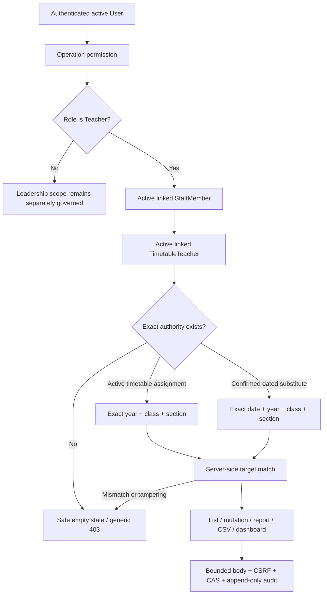

# Teacher Attendance Exact Scope Workflow

Status: `PROMPT_23C_QA_CLEARED`
Teacher attendance cutover: `CRITICAL_BLOCKER_CLEARED`
Overall Teacher replacement: `CONDITIONAL`
Branch: `security/teacher-attendance-exact-scope`
Schema or migration change: none
Operational data change: none

## Purpose and boundary

Prompt 23C closes the confirmed Teacher attendance object-scope defect. It does
not add an attendance feature, change timetable authoring, create operational
Teacher accounts, widen Parent access, or merge the feature branch. Director,
Principal and other leadership access remains governed by the existing
role-permission matrix and is never used as a fallback for a Teacher.

## Pre-change over-broad path

Before Prompt 23C, the Teacher role's attendance permission was effectively
global:

1. `VIEW_STUDENT_ATTENDANCE`, `MANAGE_STUDENT_ATTENDANCE` and
   `SUBMIT_STUDENT_ATTENDANCE` exposed the page and API.
2. The page built its selector from every active Student cohort.
3. GET and POST accepted a caller-selected date, academic year, class and
   section after checking only the role permission.
4. `activeStudentsForScope()` protected the requested roster from inactive
   Students but never bound it to the authenticated user's `StaffMember`,
   `TimetableTeacher`, `TimetableAssignment` or substitute duty.
5. Reports, CSV export and dashboard attendance totals used the same broad
   cohort universe.

Changing a selector value or direct API payload could therefore cross class,
section and academic-year boundaries. This was an object-scope/IDOR-class
defect even though the object key was a cohort tuple rather than one numeric ID.

## Authoritative resolver

`lib/teacher-attendance-scope.ts` is the shared server-only authority. A Teacher
scope exists only when all of the following are true:

- the authenticated User is active, as enforced by session verification;
- the User has role `TEACHER`;
- exactly one active linked `StaffMember` is found;
- that Staff record links to an active `TimetableTeacher`;
- the assignment, class/section and subject are active;
- the assignment and class/section use the selected current academic year;
- the exact canonical class and exact canonical section match; and
- the date belongs to that academic year.

Role permission is only the operation gate. It never creates a cohort.
Missing/inactive links, malformed values, stale academic years and failed scope
resolution return a safe empty state or generic 403 without a broad fallback.

The current timetable schema represents a class/section tuple explicitly.
Blank section is an exact blank-section cohort, not a wildcard. No class-wide
wildcard is inferred. A future class-wide attendance-owner concept would need
an explicit model and approval before it could broaden this resolver.

## Dated substitutes

A substitute target requires a `CONFIRMED` `SubstituteAssignment` whose:

- `substituteStaffMemberId` is the active Staff link;
- academic year, class and section match exactly;
- `assignmentDate` is the requested attendance date; and
- linked timetable assignment, when present, matches the same active
  year/class/section and active subject.

The present schema stores one assignment date, not a range. A multi-day duty is
represented by one confirmed, append-only assignment row per approved date.
The substitute receives no permanent timetable authority and no access before
or after an approved row's date.

## Enforcement points

The same resolver governs:

| Surface | Enforcement |
|---|---|
| Attendance selector | Returns only exact targets for the selected date |
| Daily list | Resolves scope before Student or session data is read |
| Create/save/clear/submit/correct/lock | Resolves exact scope before the serializable transaction |
| Student record payload | Every Student must belong to the active exact roster |
| Reports | Adds the resolver's session predicate and rejects an unrelated filter |
| CSV | Uses the same resolver/filter and private, no-store response |
| Teacher dashboard/portal totals | Counts only resolved Teacher attendance sessions |
| Direct requests | Repeats authorization server-side; UI state is not trusted |

Unknown, unrelated or tampered cohort/Student requests produce generic safe
errors and do not include Student names, raw object IDs or an alternative cohort
list.

## Mutation integrity and audit

- Attendance mutations use POST only.
- Middleware applies same-origin/CSRF checks and private/no-store responses.
- The attendance POST body is capped at 512 KiB.
- A request may contain at most 2,500 records; remarks are at most 500
  characters.
- Existing-session changes require the exact `updatedAt` version.
- The session compare-and-set is performed inside a serializable transaction.
  A stale writer receives 409 and cannot overwrite the winner.
- A submitted, unlocked session can be corrected only with a 12-500 character
  reason, a full current roster and at least one actual change.
- Every successful mutation appends a `UserAudit` event with actor role, exact
  scope, authorization source/evidence, session state, record/change counts,
  correction reason and correlation ID. It does not duplicate Student private
  data.

## User experience

The date control refreshes scope options. One available scope becomes the safe
default; zero scopes show a specific empty state without unrelated cohort
names. A dated substitute is visibly labelled. Controls are labelled, mobile
attendance targets are at least 44 px high, and the roster remains inside
`.table-wrap`. Submitted corrections use the accessible in-app
`SecurityDialog`; native `alert`, `confirm` and `prompt` are not used.

## Architecture and decision flow

The editable phase diagram is available in Canvs room
[`tcD9rmqB6KFkYmtWWo9a`](https://app.canvs.io/?room=tcD9rmqB6KFkYmtWWo9a).

## Copied-database QA contract

`pnpm.cmd qa:23c prepare|verify|inspect|cleanup|destroy` works only against the
ignored `QA23C-browser.db` copy under the guarded QA root. Independent QA uses
the separate `pnpm.cmd qa:23cqa` wrapper and fresh `QA23CQA-browser.db`. It creates two linked
Teachers, one unlinked Teacher, multiple namespaced classes/sections, active and
previous-year timetable assignments, one confirmed dated substitute, Students,
enrollments and attendance sessions. It verifies exact cross-Teacher,
cross-class, cross-section and cross-year denial; date expiry; shared
report/CSV scoping; leadership and non-teaching role boundaries; and one-winner
compare-and-set behavior.

Cleanup is targeted, idempotent and restores the copied database's complete
pre-fixture logical digest. The script compares the operational database hash
before every phase and refuses to continue if it changes.

## Implementation verification

The final copied-database run passed all eleven Prompt 23C proofs, including
one-winner compare-and-set behavior. Cleanup passed twice, restored the
complete pre-fixture logical digest with zero remaining `QA23C` rows, and the
ignored database plus runtime state were destroyed. The operational database
remained at SHA-256
`9a888627ea2af32433fdba4f2f5d02c471995145e41ace9a6d1cd0729c6eae93`
with the exact zero-data business baseline, one active Super Admin, inactive
Admin/Accountant/Viewer accounts and only
`20260722_clean_install_baseline`.

Final verification passed 274 page routes, 378 API routes, lifecycle
zero-change dry run, typecheck, all 1,576 tests across 170 files, 212/212
production-build entries with the bounded 4 GB heap, backup version 37 and Git
safety. Production Browser QA passed 1366x768 and exact 390x844 in light and
dark modes: only authorised scopes were named, the unlinked and dated
substitute states were correct, substitute expiry returned a generic scoped
denial, the accessible correction dialog used no native browser dialog, all
mobile targets were at least 44 px, tables were contained, page overflow was
zero, and console/hydration errors plus production stderr were zero.

## Independent Prompt 23C-QA disposition

Independent QA used a fresh ignored `QA23CQA` copied database and proved the
exact timetable, dated substitute, inactive-link, cross-Teacher,
cross-class/section/year, privacy, role, operation, report, CSV, CSRF, bounded
body and one-winner compare-and-set matrix. Production Browser QA passed
1366x768 and exact 390x844 in light and dark modes with contained tables,
44 px controls, visible focus, an accessible in-app correction dialog, zero
document overflow, no native browser dialog, zero console/hydration errors and
zero production stderr.

Cleanup ran twice. All QA User, StaffMember, timetable, substitute, Student,
enrollment, attendance, audit and Guardian counts were zero before the copied
database, ignored state and production logs were destroyed. The operational
database SHA-256 remained
`9a888627ea2af32433fdba4f2f5d02c471995145e41ace9a6d1cd0729c6eae93`,
with the official zero-data baseline, one active owned Super Admin, inactive
Admin/Accountant/Viewer accounts, one clean baseline migration and backup
version 37 unchanged.

Release verification passed 274 page routes, 378 API routes, lifecycle
zero-write dry run, typecheck, all 1,577 tests across 170 files, the bounded
4 GB production build with 212/212 entries, version-37 backup and Git safety.

The previous attendance object-scope defect is resolved. This clears the
critical Teacher attendance blocker only. It is not a full Teacher parity
claim: overall Teacher replacement remains `CONDITIONAL` until the remaining
Teacher workflows and role QA are complete. The next phase is `UX-1A`.
